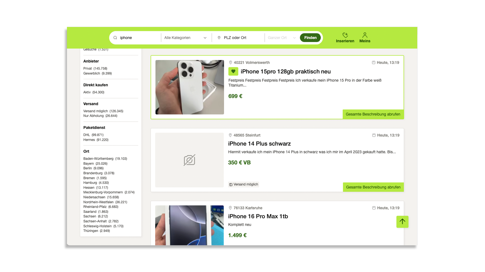

    

<h1 align="center">
Feinanzeigen
</h1>

**Eine Chrome Erweiterung, die deine Kleinanzeigen Suche aufräumt.**

## Beschreibung

Feinanzigen ist eine **open source** MIT-lizensierte Chrome Erweiterung, die deine Suche auf www.kleinanzeigen.de aufräumt. Sie entfernt unnötige Werbeanzeigen, optimiert die Darstellung und bietet erweiterte Funktionalität.

## Funktionen

- Entfernt Werbeanzeigen um das Suchlayout und aus den Suchergebnissen
- Optimiert die Darstellung des Suchlayouts und der Suchergebnisse
- Fügt einen Button zu jedem Suchergebnis hinzu, mit dem die gesamte Beschreibung geladen und in der Vorschau angezeigt werden kann
- Per Klick auf das Vorschaubild in den Suchergebnissen wird die Bildergallerie der Anzeige geöffnet. Diese kann auch per Tastatur gesteuert werden

## Installation

#### Chrome Web store

#### Manuell

- [Lade den letzten Release herunter](https://github.com/simonsagstetter/feinanzeigen/releases)
- Entpacke die ZIP Datei
- Öffne in deinem auf Chromium basierenden Webbrowser die Erweiterungseinstellungen
- Aktiviere dort den Entwicklermodus
- Klicke auf entpackte Erweiterung laden und wähle den Ordner der entpackten ZIP Datei aus

## Problembehandlung

Es können unter Umständen unterwartete Fehler auftreten, wenn Kleinanzeigen selbst neue Updates für die Benutzeroberfläche veröffentlicht. Ich werde in diesem Fall so schnell wie möglich versuchen darauf mit einem Update zu reagieren. Bitte geduldet euch dafür ein bisschen, da ich der einzige Entwickler bin, der an dieser Erweiterung arbeitet. Ihr könnt die Erweiterung in den Einstellungen eures Browsers zeitweise deaktivieren. Für alle anderen Fälle, wie Feedback, Vorschläge oder Anregungen, eröffent gerne auch einen Issue
